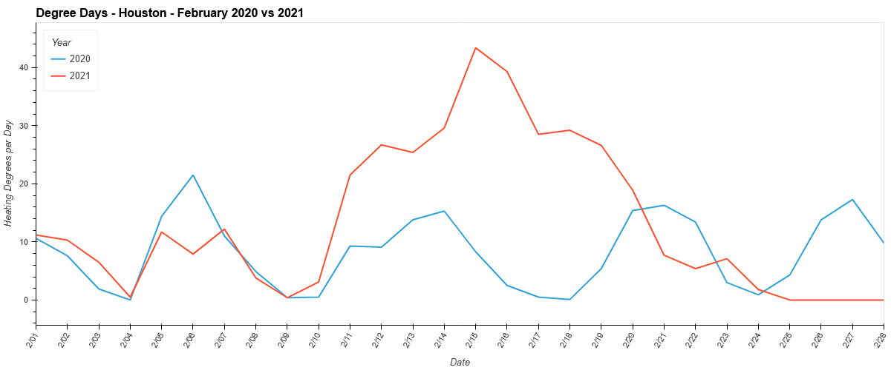
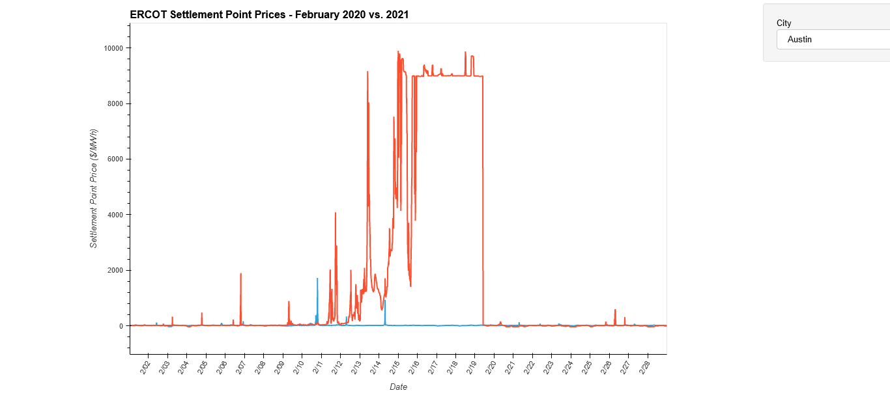

# Degree Day Analysis
Analysis of degree day data correlating energy demand with supply prices.

---
## Members
- **Chafic Charafeddine** - Weather data scraping
- **Greg Douglas** - Visualizations
- **Remy Dillenseger** - Data parsing and database creation

---
## Description
- Observing trends in energy demand using degree-day graphs over the period of January and February 2020 and 2021. 
- Observing energy market prices over the same time period, correlating changes in price to changes in demand.

---
## Research Questions
1. How did the temperature in February 2021 compare to 2020?  
- **User Story:** As a user, I want to be able to view data year over year based on the region (of Texas), so that I can compare temperature.
2. How did energy prices compare during the same time period?  
- **User Story:** As a user, I want to be able to view data year over year, so I can compare energy prices.
3. Is there any date in the range of data that shows a significant change in energy price?  
- **User Story:** As a user, I want to be able to visually correlate the temperature and price data, so that I don't have to look at spreadsheets.







---
## Installation Instructions
To save the images, you must install the package:
```shell
conda install -c conda-forge firefox geckodriver
```

---
## Data Sources
- [ERCOT](http://www.ercot.com/about) 
- [Degree Days.net](https://www.degreedays.net/about)
- [Weather Underground](https://www.wunderground.com/about/our-company)
    - Austin - Austin Energy (AEN) Load Zone
    - Corpus Christi - South Load Zone
    - Dallas - North Load Zone
    - Houston - Houston Load Zone
    - San Angelo - West Load Zone
    - San Antonio - CPS Energy Load Zone

## License
This project is licensed under the MIT License.
[Click Here](https://github.com/rdillens/Degree_Day_Analysis/blob/main/LICENSE) for more information.
